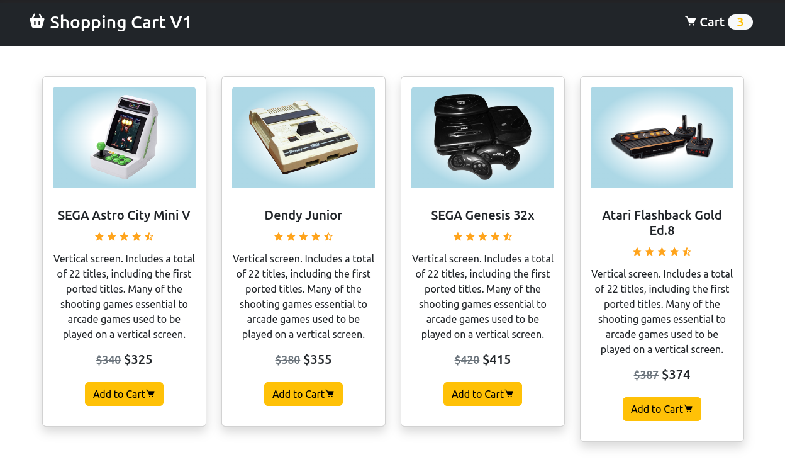
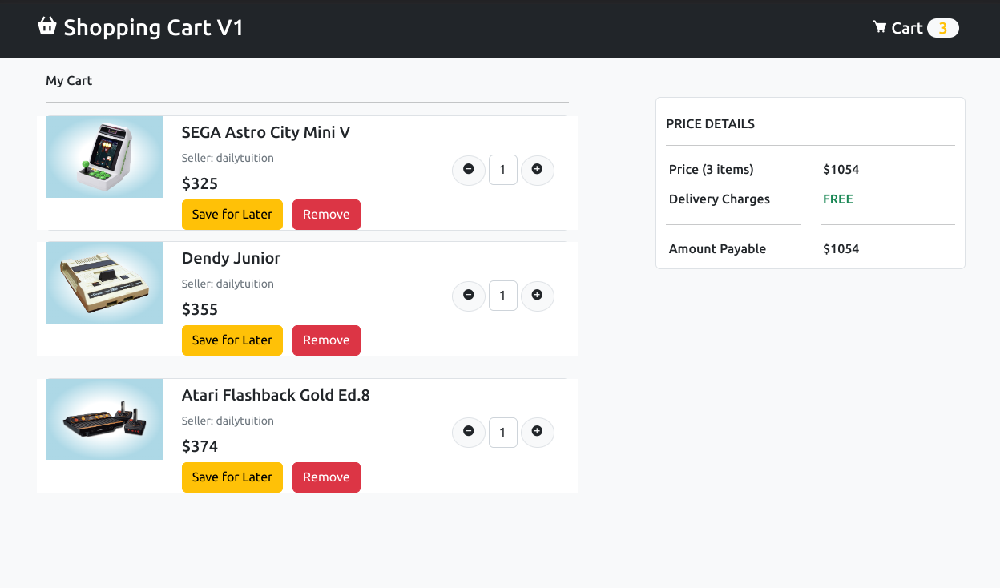

# 🛒 Dumb_Shopping_Cart_V1

Dumb Shopping Cart practice with PHP and MySql Database



-----------------------------------------------------------


## 📗 How to use:

Before you execute this project make sure you insert values in the database. to insert values in the database just type this command.
```
"INSERT INTO ProductTb (product_name, product_description, product_prev_price, product_price, product_image)
        VALUES ('SEGA Astro City Mini V','some description', 340, 325,'./assets/img/sega-astro.png'),
                        ('Dendy Junior','some description', 380, 355,'./assets/img/dendy-junior.png'),
                        ('SEGA Genesis 32x','some description', 420, 415,'./assets/img/sega-genesis-32x.png'),
                        ('Atari Flashback Gold Ed.8','some description', 387, 374,'./assets/img/atari-flashback-gold-8.png')";
```

Ones you insert these values just execute your application. that's it.

Thank you.